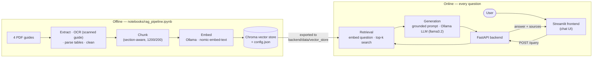

#  Egypt Travel Guide Assistant — RAG-powered document Q&A

Ask a question about travel in Egypt and get an answer that is **grounded in four official tourism guides and shows its sources** — ticket prices, opening hours, distances between cities, temperatures, history. Everything runs **locally** (Ollama for the LLM and the embeddings, Chroma as the vector store), no API keys.

*Graduation project, Level 2 Summer Training — Core Track (text-based RAG).*

## Contents
[Architecture](#architecture) · [Tech stack](#tech-stack) · [Project structure](#project-structure) · [Domain & data](#domain--data) · [Setup](#setup) · [Environment variables](#environment-variables) · [API reference](#api-reference) · [Evaluation results](#evaluation-results) · [Screenshots](#screenshots) · [Testing](#testing) · [Docker](#run-the-backend-with-docker) · [Limitations](#limitations)

## Architecture



**How a question is answered:** the question is embedded → the 5 closest chunks are fetched from Chroma → if even the best one is too far away the assistant says it does not know (no LLM call) → otherwise the chunks are put into a numbered prompt that forces the model to answer only from them and cite `[n]` → the citations are mapped back to `Document – Section (page)` labels and returned.

## Tech stack

| Layer | Technology |
|---|---|
| Data prep | PyMuPDF (text blocks, rendering), RapidOCR (scanned pages), pandas |
| Embeddings | Ollama · `nomic-embed-text` (768-d) |
| Vector store | Chroma (persistent, cosine distance) |
| LLM | Ollama · `llama3.2` (3B, runs on CPU) — configurable |
| Backend | FastAPI, Pydantic v2, pydantic-settings, Uvicorn |
| Frontend | Streamlit |
| Tests | pytest + FastAPI `TestClient` |
| Packaging | Docker (backend) |

## Project structure

```
rag-assistant-app/
├── README.md
├── requirements-notebook.txt        # environment for the notebook
├── notebooks/
│   └── rag_pipeline.ipynb           # load/OCR/clean → chunk → embed → retrieve → evaluate → export
├── data/
│   ├── raw/                         # the 4 source PDFs (NOT in git, see "Getting the data")
│   └── processed/                   # pages.jsonl, chunks.jsonl, OCR box cache (small, committed)
├── backend/
│   ├── app/
│   │   ├── main.py                  # FastAPI app, CORS, startup loading (lifespan)
│   │   ├── api/routes/query.py      # GET /health, POST /query
│   │   ├── core/config.py           # settings from .env
│   │   ├── schemas/query.py         # QueryRequest / QueryResponse
│   │   ├── services/retrieval.py    # load vector store, retrieve chunks
│   │   ├── services/generation.py   # prompt, call Ollama, extract cited sources
│   │   └── utils/logging_config.py
│   ├── data/vector_store/           # exported by the notebook (Chroma + config.json)
│   ├── tests/                       # pytest suite (12 tests)
│   ├── requirements.txt · .env.example · Dockerfile
├── frontend/
│   ├── app.py                       # Streamlit chat UI
│   ├── api_client.py                # wrapper around the backend API
│   └── requirements.txt · .env.example
└── docs/                            # evaluation_results.md (generated), screenshots, publish checklist
```

## Domain & data

**Domain:** Egypt tourism. **Corpus:** exactly four official guides — nothing else is indexed.

| File in `data/raw/` | Content | Pages | Extraction |
|---|---|---|---|
| `Egypt_Tourism_Guide-Eng.pdf` | General information, customs, money, transport, emergency numbers, and a tour of Cairo, Fayoum, Nile Valley, Luxor, Aswan, Red Sea, Sinai, oases | 61 | text layer |
| `Alexandria-Eng.pdf` | *Alexandria & the White Med*: sights with addresses/opening hours, the North Coast and El-Alamein | 100 | text layer |
| `Egypt_Map-Eng.pdf` | *Egypt Map & Guide* poster: itineraries, practical information, **temperature and distance tables** | 2 (large sheets) | text layer + table parsing |
| `Aswan_Museums_and_Sites_Guide-Eng.pdf` | *A Guide to Aswan's Museums and Archaeological Sites*: 16 sites with **opening hours and ticket prices** | 20 | **scanned → OCR** |

*(The Aswan file was supplied with an Arabic file name; rename it to the ASCII name above.)*

The data was **inspected and cleaned before indexing** — this is where most RAG quality is won or lost:
the Aswan guide is a scan (OCR with layout rebuilt from coordinates so *Visitor* / *Student* prices stay attached to the right site, dictionary-guided repair of OCR errors, gap-filling of missed lines); the map poster's numeric tables are converted into sentences such as *"Cairo to Luxor: 721 km"*; icon glyphs, curved map labels and page furniture are removed. Details and numbers are in the notebook, section 2.1.

### Getting the data
The PDFs (≈ 60 MB) are not committed. They are the Egyptian tourism authority's guides used for this project (see `experienceegypt.eg` and `mota.gov.eg`, which are printed in the documents). Put the four files in `data/raw/` under the exact names in the table above. Only the notebook needs them; the backend needs just the exported vector store.

## Setup

**Prerequisites:** Python 3.10+ (3.11 recommended), [Ollama](https://ollama.com/download), Git.

```bash
# 1. clone and create a virtual environment
git clone https://github.com/<your-username>/rag-assistant-app.git
cd rag-assistant-app
python -m venv .venv
.venv\Scripts\activate            # Windows
# source .venv/bin/activate       # macOS / Linux

# 2. pull the two Ollama models (Ollama must be running: `ollama serve` or the desktop app)
ollama pull nomic-embed-text      # embeddings (~270 MB)
ollama pull llama3.2              # LLM, 3B (~2 GB)
```

### A. Build the vector store (once) — only if `backend/data/vector_store/` is empty
```bash
pip install -r requirements-notebook.txt
# put the 4 PDFs in data/raw/  (see "Getting the data")
jupyter notebook notebooks/rag_pipeline.ipynb      # Kernel → Restart & Run All  (~5–15 min on CPU)
```
The notebook writes `backend/data/vector_store/` (+ `config.json`), `docs/evaluation_results.md` and refreshes the results table below.

### B. Backend
```bash
cd backend
pip install -r requirements.txt
cp .env.example .env              # Windows: copy .env.example .env
uvicorn app.main:app --reload     # → http://localhost:8000/docs
```
Check `http://localhost:8000/health` — it must report `"status": "ok"` (vector store loaded **and** Ollama reachable).

### C. Frontend (second terminal, same virtual environment)
```bash
cd frontend
pip install -r requirements.txt
cp .env.example .env              # Windows: copy .env.example .env   (API_BASE_URL=http://localhost:8000)
streamlit run app.py              # → http://localhost:8501
```
Ask e.g. *"How much is a visitor ticket to the Temple of Edfu?"* — you get the answer plus a numbered source list.

## Environment variables

| Variable | Where | Default | Meaning |
|---|---|---|---|
| `API_BASE_URL` | `frontend/.env` | *(required, no default)* | URL of the backend, e.g. `http://localhost:8000` |
| `OLLAMA_HOST` | `backend/.env` | `http://localhost:11434` | Where Ollama listens |
| `LLM_MODEL` | `backend/.env` | `llama3.2` | Chat model used for answers |
| `LLM_TIMEOUT` | `backend/.env` | `180` | Seconds to wait for the LLM |
| `NUM_CTX` / `TEMPERATURE` | `backend/.env` | `4096` / `0.1` | LLM context window / randomness |
| `VECTOR_STORE_DIR` | `backend/.env` | `data/vector_store` | Folder exported by the notebook |
| `EMBED_MODEL`, `TOP_K`, `MAX_DISTANCE` | `backend/.env` | from `config.json` | Override the embedding model, number of chunks, and refusal threshold recorded by the notebook |
| `CORS_ORIGINS` | `backend/.env` | `http://localhost:8501,…` | Allowed frontend origins (comma separated) |
| `LOG_LEVEL` | `backend/.env` | `INFO` | Logging level |
| `OLLAMA_HOST`, `EMBED_MODEL`, `LLM_MODEL` | shell, for the notebook | as above | The notebook reads these from the environment |

## API reference

Interactive docs: `http://localhost:8000/docs` (Swagger UI).

### `GET /health`
```bash
curl http://localhost:8000/health
```
```json
{"status": "ok", "vector_store_loaded": true, "chunks": 234, "llm_model": "llama3.2", "ollama_reachable": true}
```
`status` is `"degraded"` when the vector store is missing or Ollama cannot be reached.

### `POST /query`
Body: `{"question": "<3–1000 characters>"}`

```bash
curl -X POST http://localhost:8000/query \
  -H "Content-Type: application/json" \
  -d '{"question": "How much is a visitor ticket to the Temple of Edfu?"}'
```
Response shape (`sources` are the passages the answer cites; `[n]` in the answer matches the numbered list; the content shown is illustrative):
```json
{
  "answer": "A visitor ticket to the Temple of Edfu costs 450 EGP [1].",
  "sources": ["Aswan Guide – Temple of Edfu (p. 4)"]
}
```
If the guides do not contain the answer the API returns `"I couldn't find that in the provided documents."` with `"sources": []`.

| Status | When |
|---|---|
| 200 | answer returned (including the "couldn't find" answer) |
| 422 | invalid body (missing/blank/too short/too long `question`) |
| 503 | vector store not loaded, or Ollama unreachable / model not installed (the message says which) |

## Evaluation results

Sixteen test questions (13 in scope, drawn from all four guides — OCR'd prices and hours, parsed tables, prose — plus 3 out-of-scope questions that must be refused). The table below is **generated by the notebook** (section 2.6) and inserted here automatically; the same table is saved in [`docs/evaluation_results.md`](docs/evaluation_results.md). Failure analysis: notebook, end of section 2.6.

<!-- EVAL_TABLE_START -->
_Generated 2026-09-22 22:40 by the notebook._

**In-scope questions answered correctly:** 10/13  
**Out-of-scope questions correctly refused:** 2/3  
**Retrieval relevant (needed text in top-5):** 13/13  
**Answers with a valid citation:** 13/13  
**Models:** embeddings `nomic-embed-text`, LLM `llama3.2` · chunk size 1200/200 · refusal threshold 0.395

|   # | Question                                                                       | Retrieved source (top-1)                             | Answer                                                                                                                                                       | Correct?   |
|----:|:-------------------------------------------------------------------------------|:-----------------------------------------------------|:-------------------------------------------------------------------------------------------------------------------------------------------------------------|:-----------|
|   1 | How much is a visitor ticket to the Temple of Edfu?                            | Aswan Guide – Temple of Edfu (p. 4)                  | The visitor ticket to the Temple of Edfu costs 450 EGP [1].                                                                                                  | ✅         |
|   2 | What are the opening hours of the Nubian Museum?                               | Aswan Guide – Nubian Museum (p. 10)                  | The opening hours of the Nubian Museum are 9:00 am – 5:00 pm, with extended hours on Thursdays and Fridays from 9:00 am – 5:00 pm and 6:00 pm – 9:00 pm [1]. | ✅         |
|   3 | How much does the Sun Alignment ticket at Abu Simbel cost?                     | Aswan Guide – Abu Simbel (p. 18)                     | The Sun Alignment ticket at Abu Simbel costs 900 EGP for visitors and 450 EGP for students. [1][2]                                                           | ✅         |
|   4 | Which gods is the temple of Kom Ombo dedicated to?                             | Egypt Tourism Guide (p. 34)                          | The temple of Kom Ombo is dedicated to two deities: the crocodile god Sobek, and the falcon god Harwer (Horus the Elder). [1][2]                             | ✅         |
|   5 | How much would the Unfinished Obelisk have weighed and who commissioned it?    | Aswan Guide – Unfinished Obelisk (p. 12)             | The Unfinished Obelisk would have weighed 1168 tons and was commissioned by Hatshepsut [1][2].                                                               | ✅         |
|   6 | What are the emergency phone numbers for the police and an ambulance in Egypt? | Alexandria Guide (p. 96)                             | The emergency phone numbers for the police and an ambulance in Egypt are: * Police: 122 [1][2] * Ambulance: 123 [1][2]                                       | ✅         |
|   7 | What is Egypt's currency and how is it divided?                                | Alexandria Guide (p. 94)                             | Egypt's currency is the Egyptian pound, which is divided into 100 piasters [1][2][3].                                                                        | ✅         |
|   8 | What is the distance between Siwa Oasis and Alexandria in kilometres?          | Egypt Map & Guide – Distances from Siwa Oasis (p. 2) | The distance between Siwa Oasis and Alexandria is 590 km [1][2].                                                                                             | ✅         |
|   9 | What is the average maximum temperature in Aswan in August?                    | Egypt Map & Guide – Temperatures in Aswan (p. 2)     | The average maximum temperature in Aswan in August is 40 °C [1].                                                                                             | ❌         |
|  10 | What are the opening hours of Qaitbey Citadel?                                 | Alexandria Guide (p. 29)                             | The opening hours of Qaitbey Citadel are 9am-4:30pm [1].                                                                                                     | ✅         |
|  11 | Who founded Alexandria and in which year?                                      | Egypt Tourism Guide (p. 39)                          | Alexandria was founded by Alexander the Great in 331 B.C.E [1].                                                                                              | ❌         |
|  12 | Which oasis is known as the 'Northern Oasis'?                                  | Egypt Map & Guide (p. 1)                             | The Northern Oasis is approximately 4000 km2 desert depression, set in black volcanic rock, and is reachable from Cairo within a 7-hour drive [1].           | ❌         |
|  13 | What phone number can I call for complaints about the Aswan sites?             | Aswan Guide (p. 19)                                  | You can call 19654 for complaints and suggestions about the Aswan sites. [1]                                                                                 | ✅         |
|  14 | What is the ticket price for the Great Pyramid of Giza?                        | Egypt Tourism Guide (p. 16)                          | The ticket price for the Great Pyramid of Giza is not mentioned in the provided passages.                                                                    | ❌         |
|  15 | Who won the 2022 FIFA World Cup?                                               | Egypt Tourism Guide (p. 16)                          | I couldn't find that in the provided documents.                                                                                                              | ✅         |
|  16 | What is the best restaurant in Paris?                                          | Alexandria Guide (p. 12)                             | I couldn't find that in the provided documents.                                                                                                              | ✅         |
<!-- EVAL_TABLE_END -->

## Screenshots

| Answer with sources | Out-of-scope question refused | Swagger UI |
|---|---|---|
|  |  |  |

*(Save your own screenshots with these names into `docs/screenshots/`.)*

## Testing
```bash
cd backend
pytest -v
```
12 tests cover: happy path, invalid input → 422 (missing, blank, too short, too long, wrong type), `/health`, graceful 503 when the vector store is missing or Ollama is down, CORS, and — against a real temporary Chroma store with a fake Ollama — retrieval order, refusal without an LLM call, citation mapping/renumbering and prompt construction. No Ollama is needed to run the tests.

## Run the backend with Docker
Ollama keeps running on the host; the container talks to it via `host.docker.internal`.
```bash
cd backend
docker build -t egypt-rag-api .
docker run --rm -p 8000:8000 --add-host=host.docker.internal:host-gateway egypt-rag-api
```
(`--add-host` is needed on Linux; Docker Desktop on Windows/macOS provides the host name itself.) The vector store must exist in `backend/data/vector_store/` before building the image.

## Limitations
* Answers are only as good as the four guides: they are brochures (Alexandria's is from 2010), prices and hours change, and the guides sometimes disagree with each other (e.g. Cairo–Aswan is 950 km in the Tourism Guide text and 982 km in the distance table). The prompt asks the model to report both values.
* Photo-only pages and image-only maps (e.g. the Alexandria street map legend) are not searchable.
* OCR of the Aswan guide was checked page by page but a residual typo may remain.
* Small local models (3B) can miss a fact that is in the retrieved passages; larger models (`ollama pull llama3.1:8b`, then `LLM_MODEL=llama3.1:8b`) do better if your hardware allows.
* English only.
